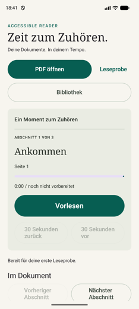
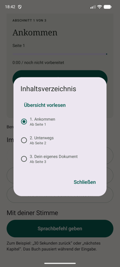

# Accessible Reader for Android

An open PDF reader that reads books aloud, built for people who cannot see the screen.

Not a reader with accessibility added afterwards. TalkBack, spoken commands, headset and Bluetooth buttons and chapter navigation were the first requirements, not later ones. It is developed together with a friend of the author who has been blind since birth and who tests every version on her own phone.

Prototype, version 0.4.2. Usable, not finished.

| Main screen | Table of contents | Voices and engines |
| --- | --- | --- |
|  |  |  |

The interface and everything the app says out loud are German, because it was built with and for a German-speaking blind test reader. Nothing in the code assumes German. Making it multilingual is an open task and a good first contribution; the strings in `ui/ReaderScreen.kt`, `core/ReaderModels.kt` and `core/Library.kt` are where to start.

## Why this exists

Readers with good voices exist. The blind test user tried several and went back to what she had. Her reasons, in her words: the good voices cost real money, and the readers that bundle them want a subscription on top. But the deciding factor was not price, it was operability. Those apps are built for sighted people who want a voice-over for a video, and they are not thought through for a screen reader.

So the goal here is narrow and specific: an app whose every function is reachable by ear, that costs nothing to use, and that keeps books on the device.

## What works

- **Text PDFs** from the file picker or from another app's share menu. Sharing a PDF from a messenger drops it straight into the library.
- **A library** of everything imported, newest first, each row speaking its title, length and where you stopped. Removal asks first.
- **Chapters** from PDF bookmarks, otherwise one chapter per page. No headings are guessed.
- **Playback that does not stutter.** Text is split at sentence boundaries, and playback starts once at least twelve seconds of audio is buffered ahead. The rest is synthesized while you listen and appended seamlessly.
- **Spoken chapter announcements** in the book voice, so you know where you are without a screen reader. A finished chapter continues into the next without any input.
- **Exact 30 second jumps** on the real audio timeline, across the boundaries of the underlying audio files, independent of text length and speaking rate.
- **Media keys that mean chapters.** On a headset, a Bluetooth speaker or in the media notification, next and previous move by chapter rather than by audio fragment. Previous returns to the chapter start first, as Media3 does for tracks. The notification also carries explicit 30 second buttons.
- **Any installed speech engine** can be selected, including licensed engines that report no individual voices. Each voice has a *Probe* button speaking one identical sample with numbers, a date and abbreviations, so voices can be compared by ear.
- **A self diagnosis** that probes every installed engine separately and reports what each can do, as shareable plain text. Built because the target device could not be inspected from here.
- **The listening position survives** pausing, leaving the app and closing it.
- **Voice commands**, recognised on the device, started only by a button press. Never a silent fallback to cloud recognition.
- **Speed** from 0.5 to 2.0, remembered.

No `INTERNET` permission. No cloud keys. PDFs and generated audio stay in private app storage.

## Documentation

- **[docs/BEDIENUNG.md](docs/BEDIENUNG.md)** — the user manual, in German, written to be listened to rather than looked at. Start here if you want to use the app.
- **[docs/VOICES.md](docs/VOICES.md)** — how Android speech engines work, how to select one, and how to add a free neural voice that sounds better than the stock ones. Also the costs of cloud voices, and how to write another provider.
- **[docs/ARCHITECTURE.md](docs/ARCHITECTURE.md)** — how it is built and why.
- **[docs/decisions/](docs/decisions/)** — the decisions that shaped it, with their reasoning.
- **[docs/PLAN.md](docs/PLAN.md)** — the full product target. Not a list of finished features.
- **[docs/TESTING.md](docs/TESTING.md)** — how this is tested without sight, and the limits of testing by a sighted developer.
- **[docs/COLLABORATION.md](docs/COLLABORATION.md)** — how the collaboration works and what is deliberately kept out of this repository.

Everything a developer reads is English. The one deliberate exception is [docs/BEDIENUNG.md](docs/BEDIENUNG.md), the manual for the people using the app today, which is German because the app is.

## Voices

The app ships no voice. It uses the engines already on the phone and lets you pick one, which turns out to matter more than expected.

A licensed engine such as Vocalizer or Acapela can report zero voices through the modern Android API while speaking fluently, because it implements only the older language query. An app that asks the modern way only concludes there is no German voice and refuses to work. This one asks both ways.

Because audio is produced ahead of playback and cached, latency is hidden. That makes slow, good-sounding neural voices a fit here, where they are unusable for a screen reader. You can keep a fast engine for TalkBack and a slow one in this app.

Before installing anything, run the diagnosis and look at what is already installed. On the target device Google's engine alone offered 13 offline German voices, eight of them from a newer and noticeably better series. Details, including a verified recipe for a free neural voice, are in [docs/VOICES.md](docs/VOICES.md).

## Build

Java 17, Android SDK 36, build tools 36.0.0. minSdk 26, targetSdk 36. AGP 9.4.0 on Gradle 9.6.0.

```sh
./gradlew :app:assembleDebug :app:testDebugUnitTest :app:lintDebug
./gradlew :app:connectedDebugAndroidTest
```

The debug APK lands in `app/build/outputs/apk/debug/`.

Device tests need an emulator or phone with German offline voice data. Pass one test class per invocation; a comma-separated list only runs the first under AGP 9.

**Turn TalkBack off before an automated run.** With it enabled every status update makes it speak and hold audio focus, so playback tests stall and time out. Measured: 43 to 79 seconds per test with it off, against 240 second timeouts with it on. The commands are in [docs/TESTING.md](docs/TESTING.md). That also means automated tests and manual accessibility testing cannot run at the same time.

## Limits

- **Scanned pages are read by on-device text recognition.** A page without a text layer is rendered and recognized, measured at about 1.2 seconds per page on an emulator, so a 500-page scan costs around ten minutes once, while importing and with progress reported. It runs with the radios switched off; the recognition model sits inside the APK and the manifest removes the network permissions the library declares. Recognition makes mistakes, and the document notice says how many pages went through it.
- A book where neither extraction nor recognition finds writing is refused after a sample of 25 pages, not after reading it all.
- Running page numbers, soft hyphens and words cut in half by a page break are repaired before speaking. Six real books, 524 to 8 pages, were imported and read to verify this.
- Maximum 120 MB, 3000 pages, six million extracted characters per PDF. A generated 600-page novel imports in four seconds on an emulator.
- A PDF without bookmarks is grouped into sections of roughly ten minutes of listening, not one section per page. The opening of the next section is prepared while the current one plays, so a section change costs well under a second with the stock voices instead of nine seconds of silence.
- Bookmarks map to page starts. Several bookmarks on one page collapse into one entry. Tables, footnotes and multi-column layouts can come out in the wrong reading order, and a two-column page can interleave its columns sentence by sentence.
- One listening position per document. No search, no user bookmarks.
- The spoken chapter announcement cannot be switched off.
- Chapter changes by media key and automatic continuation need the app alive in the background. Once it is swiped out of the recents list, only the current chapter plays to the end; pause and the 30 second jumps keep working. Moving document handling and synthesis into the playback service is the next larger piece of work.
- Changing the voice restarts the chapter from the beginning.
- Generated audio is trimmed at 500 MB, least recently heard first, and re-synthesized if needed.
- No formal accessibility audit yet, and no systematic testing across manufacturers.

## Principles

- Blind users test from the beginning, not at the end.
- The free core function must not depend on a cloud provider.
- Better voices are welcome as long as they cost no money, no API key and no permission this app has to hold.
- More natural cloud voices stay optional and get a hard spending cap.
- PDFs and generated audio stay on the device wherever possible.
- Every important function is reachable by TalkBack, by voice and by media keys.
- Voices are judged in long listening tests, not from short marketing samples.

## Another language

The app speaks German only. Nothing in the code assumes it, and adding a language is the most useful contribution this project could get.

The honest starting point: the strings are hardcoded in Kotlin, roughly 123 of them across ten files, and there is no `strings.xml` yet. Extracting them into resources is step one and a good piece of work on its own. The ones you meet first live in `ui/ReaderScreen.kt` (buttons and the settings dialog), `core/Library.kt` (library and opening messages), `core/ReaderModels.kt` (section announcements and the voice command parser) and `data/DocumentStore.kt` (import messages).

Two things a translator should know before touching anything:

- **Voice commands are matched against German words** in `CommandParser`. A new language needs its own word list, not a translated one. "Vorlesen" is one word; the English equivalent a listener would actually say is not.
- **Announcements are heard, never seen.** Length matters more than elegance. A section announcement that takes four seconds to speak is four seconds of a book not being read.

The German strings that appear throughout this documentation, so you can follow the examples:

| German | What it means |
| --- | --- |
| Vorlesen | read aloud, the play button |
| Pause | pause |
| Bibliothek, Meine Bücher | library, my books, both reach the library |
| Inhaltsverzeichnis, Übersicht vorlesen | table of contents, read the overview aloud |
| Abschnitt 2 von 3 | section 2 of 3 |
| 30 Sekunden zurück | 30 seconds back |
| Zurück, Weiter | previous, next |
| Entfernen, Ja, entfernen | remove, and the confirmation "yes, remove" |
| Probe, Hörprobe für … | sample, listening sample for … |
| Erzeugtes Audio löschen | delete generated audio |
| Standardstimme dieser Sprachausgabe | default voice of this speech engine |
| Stimmen von Google: 5 | voices from Google: 5, the heading over the voice list |
| Vorlesen drücken | press read aloud, shown in the position line before any audio exists |
| Ankommen | "Arriving", a chapter title from the sample document |

## Contributing

The most valuable contribution is not code. If you use a screen reader and this app annoys you, say where. Issues describing a dead end, an unclear announcement or an unnecessary swipe are worth more than a patch.

If you do write code, the constraints that must hold:

- every core action reachable by TalkBack, by voice command and by media key, never by gesture alone
- no `INTERNET` permission, and no cloud dependency in the free core function
- never change a focused control's label in response to a screen reader speaking
- two controls on screen must not carry the same name
- user-facing strings stay German, developer-facing text stays English

`CLAUDE.md` in the repository root carries the working notes for the codebase, including the traps that already cost time.

## Licence

MIT, see [LICENSE](LICENSE). Use it, fork it, ship it. If it helps one more person get through a book, that is the point.

The dependencies carry their own licences. PDFBox-Android is Apache 2.0, Media3 and the AndroidX libraries likewise. No voice models are bundled.
