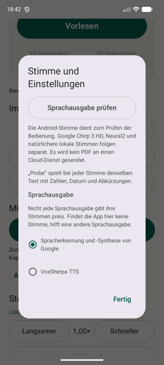

# Voices and speech engines

This reader does not ship a voice. It uses the speech engines already installed on the phone, and it lets you choose which one. This page explains why that matters, how to pick one, and how to add a neural voice that sounds far better than the stock ones.

Everything here was verified on a real device and on an emulator. Where a claim is untested, it says so.

## How Android speech works, and where it breaks

Android has a system-wide text-to-speech layer. Any app can register itself as an engine, and any other app can ask that engine to speak. Google's engine ships on most phones; licensed engines such as Vocalizer or Acapela are sold separately and are common among blind users, because they were the good-sounding option for many years.

An app can ask an engine for its voices in two ways:

1. **`getVoices()`**, added in API 21. Returns named `Voice` objects with locale, quality and an offline flag.
2. **`isLanguageAvailable(Locale)`**, the older call. Answers only "can you do this language".

Here is the catch that cost this project a day: **licensed engines frequently implement only the second one.** On the target device, Vocalizer and Acapela both report *zero* voices through `getVoices()` while speaking fluent German all day long. An app that only asks the modern way concludes there is no German voice and refuses to work.

This reader therefore asks twice. If an engine names voices, they appear individually. If it names none but reports German as available, a single entry called *Standardstimme dieser Sprachausgabe* stands for whatever voice that engine uses by default, and synthesis sets the language instead of a voice.

## Why this reader can use slow voices

Most readers and every screen reader speak live. That makes latency the deciding factor, and it rules out the good neural voices, which need a moment before the first sound.

This reader does not speak live. It asks the engine to **write audio into files**, keeps at least twelve seconds of audio buffered ahead, appends further parts while you listen, and caches everything. Latency is hidden by design.

The practical consequence: a slow, beautiful voice is a good fit here and a bad fit for TalkBack. You can keep a fast engine as your system default for the screen reader and pick a slow one inside this app. The reader's choice is independent of the system setting.

The requirement this shifts the weight onto is different: **the engine must support `synthesizeToFile`.** On the target device all three installed engines do. The app's own diagnosis tells you for any device.

## Choosing an engine and a voice in the app

1. Scroll to *Stimme & Tempo* and open *Stimme und Einstellungen*.
2. The first button is *Sprachausgabe prüfen*. It probes every installed engine one at a time and reports what each can do. Takes up to two minutes.
3. Under *Sprachausgabe*, pick the engine.
4. Under *Stimmen*, pick a voice. Each has a *Probe* button that speaks one identical sample containing numbers, a date and abbreviations, so voices can be compared fairly by ear rather than by name.



The sample text is deliberately the same for every voice. Comparing voices on different sentences tells you nothing.

## Reading the diagnosis

The report is plain text and can be shared from the app. One block per engine:

```
Sprachmaschine 2: Google (com.google.android.tts)
  Start: ok
  Deutsch: verfügbar
  Gemeldete deutsche Stimmen: 17, davon offline: 13
    de-de-x-star05-local, de_DE, offline, Qualität 400
  Audio in eine Datei schreiben: funktioniert, 7650 Millisekunden, 358 Kilobyte
```

The decisive line is the last one. `funktioniert` means the engine is usable by this reader. `fehlgeschlagen` means it is not, no matter how good it sounds.

`Gemeldete deutsche Stimmen: 0` is not a problem by itself; see the two-step lookup above.

## Look at what you already have first

Before installing anything, run the diagnosis and read the voice list. Google's engine often carries more voices than people realise, and the newer ones are markedly better than the older ones.

On the target device the report listed 13 offline German voices from Google alone. Eight belong to the newer series whose names contain `star`, for example `de-de-x-star05-local`. Those sound noticeably more natural than the older `dea`, `deb` and `deg` voices. They were already installed, cost nothing and need no network.

If your device has them, try those before anything else on this page.

## Adding a neural voice for free: VoxSherpa with Piper

[VoxSherpa TTS](https://play.google.com/store/apps/details?id=com.CodeBySonu.VoxSherpa) is a free, open-source Android app ([source](https://github.com/CodeBySonu95/VoxSherpa-TTS)) that is not a reader but an engine. It registers itself system-wide, so it shows up in this app's engine list without any change to this app. It runs Piper and Kokoro models fully offline through Sherpa-ONNX. Requirements: Android 11 or newer, ARM64, roughly 500 MB for models.

Verified on an emulator: after importing the German Piper voice *Thorsten high*, this reader's diagnosis reported

```
Deutsch: verfügbar
Stimme: de_DE-thorsten-high.onnx, offline, Qualität 500
Audio in eine Datei schreiben: funktioniert, 9486 Millisekunden, 408 Kilobyte
```

Quality tier 500 against 400 for Google's voices, and it names the voice properly, so it appears as a real selectable entry.

### The one German model worth importing

VoxSherpa's built-in catalogue holds 14 models, of which exactly one is German: *Eva-low*, 22 MB, the weakest tier. It is unlikely to beat a licensed engine.

The good German Piper voice is **Thorsten in the `high` tier**, from the public-domain [Thorsten-Voice](https://github.com/thorstenMueller/Thorsten-Voice) dataset. It is the only German Piper voice trained at the top tier; the others sit one or two tiers lower and sound mechanical. It is not in the built-in catalogue and has to be imported by hand.

### Step by step, with the two traps

Roughly fifteen minutes.

1. Install VoxSherpa TTS from the Play Store.
2. Download `vits-piper-de_DE-thorsten-high.tar.bz2` (110 MB) from the [sherpa-onnx model release](https://github.com/k2-fsa/sherpa-onnx/releases/tag/tts-models).
3. Unpack it. Two files out of it are needed: the `.onnx` file and `tokens.txt`. Copy both onto the phone.
4. In VoxSherpa open *Models*, then the blue plus. Choose the `.onnx` file and then `tokens.txt`.
5. **Trap one.** The two fields under *Model Details* look like text fields. They are dropdowns, and the arrow on the right opens them. The left one is the language and it is mandatory; without it the import fails with *Please select a Language!*. The right one is the voice gender.
6. Scroll down and tap *Import to Library*. The model count rises by one.
7. **Trap two.** The model is imported but not yet active. Scroll to the new entry in the model list and tap *Use Voice*. It then reads *Remove*, which is how you know it took.
8. VoxSherpa's settings will still claim *0 local models imported, 0.00 MB*. That is a display bug in VoxSherpa. Ignore it.
9. In this reader, open *Stimme und Einstellungen*, select VoxSherpa as the engine, and use *Probe*.

Only import Piper or VITS models. VoxSherpa itself warns that other ONNX models, Kokoro among them, may crash the app when imported this way.

### What it costs you

Thorsten needs longer to speak than Google or a licensed engine. Measured on an emulator: about ten seconds for a short sentence, against eight for Google. Real hardware is considerably faster, but it stays the slower option.

For this reader that mostly does not matter, because audio is produced ahead of playback. What you do notice is the first tap on *Vorlesen* taking longer before sound starts. After that it runs through.

## Buying a voice

Voices bought for Vocalizer or Acapela work here, because this app talks to whatever engine you select rather than shipping its own voices. Install the engine, buy the voice inside it, then pick that engine in this app. Nothing else is needed.

Note that such engines usually report no individual voices, so this app will offer a single *Standardstimme dieser Sprachausgabe* entry rather than a list. It uses whichever voice you configured inside that engine.

## Cloud voices, and why they are not built in

The voices people mean when they say "like the AI ones" are cloud services. They would sound best and they are not implemented, on purpose:

- this app holds no `INTERNET` permission, and the free core function must not depend on a provider
- the book text would leave the device
- it costs money per character

If it is ever added, it belongs behind explicit consent, a stored key and a hard spending cap, as an additional `SpeechProvider` implementation. The interface was designed for that.

Rough list prices as of September 2026, for orientation only:

| Provider and model | Per 1M characters | A 300-page book, about 540k characters |
| --- | --- | --- |
| OpenAI TTS standard | 15 USD | about 8 USD |
| OpenAI TTS HD | 30 USD | about 16 USD |
| ElevenLabs Flash or Turbo | 50 USD | about 27 USD |
| ElevenLabs v3 or Multilingual v2 | 100 USD | about 54 USD |

One property of this reader changes that arithmetic: because generated audio is cached, **a book is paid for once, not once per listen.** That is a different deal from a subscription reader.

## Writing another provider

`speech/SpeechProvider.kt` is the seam:

```kotlin
interface SpeechProvider {
    val providerId: String
    suspend fun voices(): List<ReaderVoice>
    suspend fun synthesize(text: String, voiceId: String): SpeechAudio
    fun close()
}
```

`synthesize` returns a playable file and its duration. Everything above it, chunking, the minimum lead, appending during playback, the cache and the chapter timeline, is provider-agnostic. A cloud implementation has to enforce consent and a budget before it synthesizes anything.

Cached audio is keyed by provider, engine, voice and text, so audio from two engines can never be confused.

## Online voices, and what they cost

Researched on 13 September 2026. Prices are per 800,000 characters, which is roughly one 500-page book.

| Option | Per book | Key needed | Where the text goes |
| --- | --- | --- | --- |
| **Network voices of the installed engine** | nothing | none | to the engine vendor, no published terms found |
| Google Chirp 3 HD | about 24 dollars, first million characters per month free | Google Cloud project with billing | United States, no EU endpoint for Chirp |
| Google Neural2 | about 13 dollars | same | EU endpoint available |
| Azure Neural | about 12 dollars | Azure subscription | EU region, documented as not retained and not used for training |
| Amazon Polly Generative | about 24 dollars | AWS account | content may be used for service improvement unless an organisation policy opts out |
| ElevenLabs | about 80 dollars | yes | training on submitted content is on by default below the enterprise tier |

Prices change; check them before relying on any of these. The figures above come from each vendor's own pricing page on that date.

**What this project uses: the first row, and nothing else.** The reasoning is in [decision 0005](decisions/0005-online-voices-of-the-speech-engine.md). The short version is that every cloud option needs a sighted person to create an account and a key, which makes it unusable for the person it is meant to help, and puts one private individual in the position of paying for and being legally responsible for someone else's reading.

If you are building your own version and want a cloud voice, write it as another `SpeechProvider`. The interface is described above. Three things it must do that the local one does not: keep a hard spending limit, ask before the first byte of a book leaves the device, and fail back to a local voice rather than stopping mid-chapter.

### Using the engine's own network voices

Nothing to install. If the speech engine offers German voices that need the internet, they appear in the voice list marked „braucht Internet" [needs internet]. The app itself has no internet permission and never connects; the engine fetches the audio in its own process.

Under "Stimmen aus dem Internet" in the settings, three choices decide when they may be used: only on Wi-Fi, which is the default, also on mobile data, or never. Pick a voice that needs the internet while the connection does not allow it and the app says so before it prepares anything, naming what to change.
